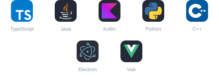

<samp>Hello, world.</samp>

&nbsp;

&nbsp;

&nbsp;

[关于我](#about) &nbsp; / &nbsp; [项目](#projects) &nbsp; / &nbsp; [技术栈](#stack)

## 01 / About

ArkTS / 鸿蒙生态，Java、Python、C++、Electron。

## 02 / Selected Projects

<table width="100%">
<tr>
<td width="440" valign="top">

01 &nbsp; / &nbsp; HARMONYOS · AI

### [AIBox · ImmersiveAI](https://github.com/LoMoCatAp/ImmersiveAI)

HarmonyOS AI 聚合客户端。

`多供应商` `流式对话` `本地 API Key`

</td>
<td width="440" valign="top">

02 &nbsp; / &nbsp; HARMONYOS · CLIENT

### [PezMax](https://github.com/LoMoCatAp/PezMax-HarmonyOS)

PezMax 的鸿蒙客户端。

`HarmonyOS` `客户端`

</td>
</tr>
<tr>
<td width="440" valign="top">

03 &nbsp; / &nbsp; HARMONYOS · READING

### [Bika](https://github.com/LoMoCatAp/Bika-HarmonyOS)

哔咔漫画的鸿蒙第三方客户端。

`HarmonyOS` `漫画阅读`

</td>
<td width="440" valign="top">

04 &nbsp; / &nbsp; WINDOWS · UTILITY

### [FileEncryptor](https://github.com/LoMoCatAp/FileEncryptor)

Windows 离线文件加密工具。

`Windows` `离线使用` `文件加密`

</td>
</tr>
<tr>
<td width="440" valign="top">

05 &nbsp; / &nbsp; JAVA · WEB

### [JavaMahjong_web](https://github.com/LoMoCatAp/JavaMahjong_web)

基于 Java 后端的 Web 联机麻将。

`Java` `Web` `联机麻将`

</td>
<td width="440" valign="top">

06 &nbsp; / &nbsp; MORE TO EXPLORE

### [其他](https://github.com/LoMoCatAp?tab=repositories)

零散的工具与原型。

`Tools` `Experiments` `Ideas`

</td>
</tr>
</table>

<a href="https://github.com/LoMoCatAp?tab=repositories">浏览全部仓库 ↗</a>

## 03 / Toolbox

**ArkTS · HarmonyOS**

常用语言、框架与工具

<!-- Icons: https://github.com/tandpfun/skill-icons | License: assets/skill-icons-LICENSE.txt -->

**Thanks for stopping by.**

Bug 和需求请提 issue。

<a href="https://lomocat.xyz/">博客</a> &nbsp; · &nbsp; <a href="https://space.bilibili.com/387724668">B站</a> &nbsp; · &nbsp; <a href="https://ifdian.net/a/lomocat">支持</a>

